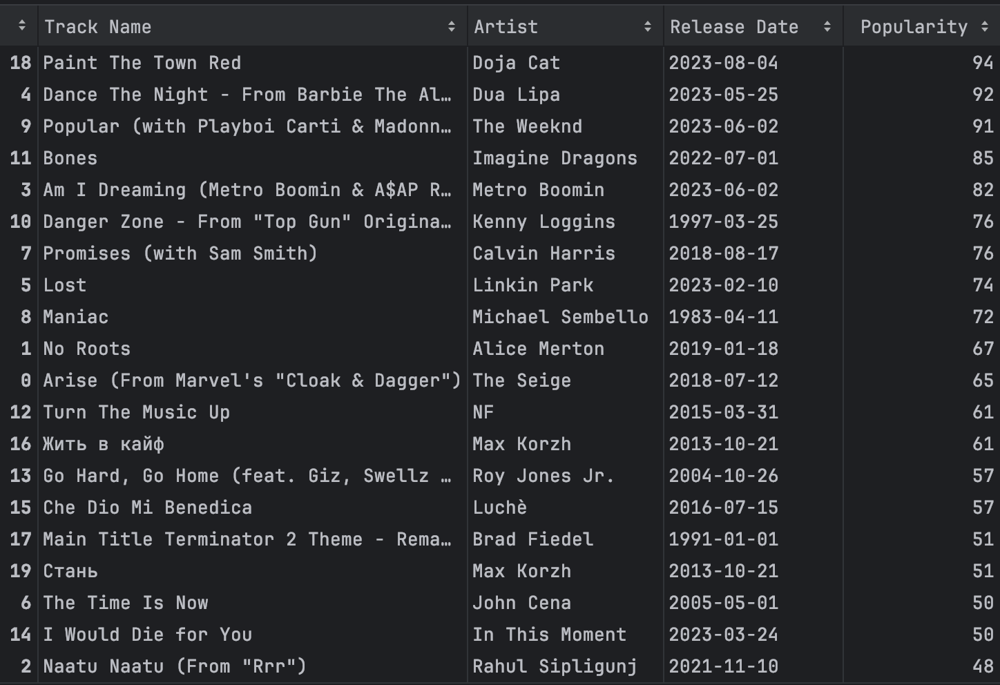
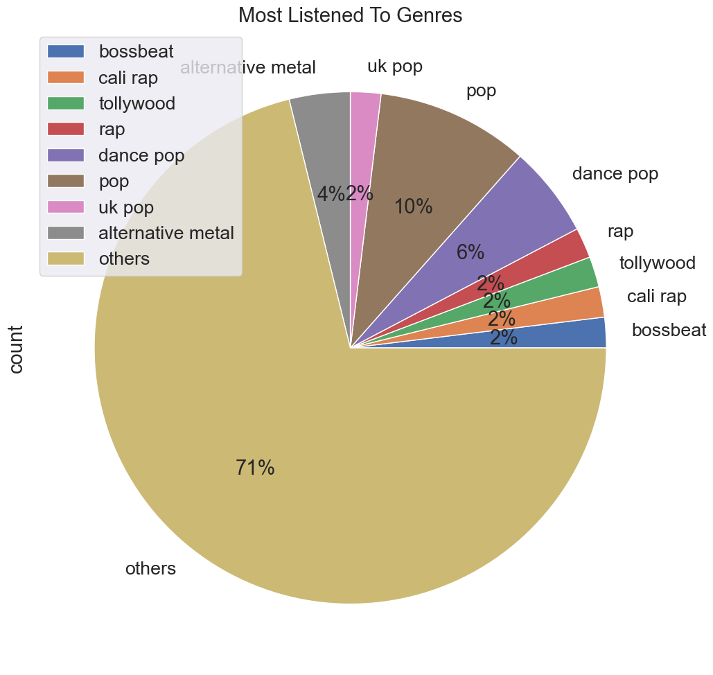

# Spotify Data

A Jupyter notebook for visualizing a user's top artist / track data in Spotify.

### Top Track Attribute Heatmap:

### Top Tracks:

### User Genres:

Time range can be configured by setting the `t_range` variable. Acceptable values include:

- `short_term`
- `medium_term`
- `long_term`

Track Attributes:

- Danceability
- Energy
- Loudness
- Speechiness
- Acousticness
- Instrumentalness
- Liveness
- Valence
- Tempo

## Getting Started

1. Sign up for a free [Spotify Developer account](https://developer.spotify.com/).
2. Create a custom Spotify app via the App Dashboard, adding `http://localhost:8080` as a valid redirect URI.
3. Add your Spotify as a valid user under the 'Users and Access' section of the custom Spotify app.
4. Rename `sample.env` to `.env`.
5. Populate the missing `.env` values from the custom Spotify app.
6. [OPTIONAL] Enable Python virtual environment.
7. Install requirements: `pip install -r requirements.txt`.
8. Run the notebook: `jupyter notebook`.

*** OAuth credentials are stored in .cache. Remove this file to recreate credentials. ***